# Analisis Rendimiento de Jugadores FIFA-19
Aplicación de técnicas de análisis de datos para evaluar su rendimiento de jugadores de fútbol. Incluye limpieza de datos, exploración del dataset y la creación de un modelo predictivo utilizando técnicas de machine learning. El objetivo será predecir métricas de rendimiento (Overall) de los jugadores a partir de variables técnicas, físicas y económicas.

---

## 1. Preparación y limpieza de los datos
**Fuente: Dataset oficial FIFA-19 (Kaggle, versión 2019):** https://www.kaggle.com/datasets/javagarm/fifa-19-complete-player-dataset

Procesos aplicados:

- Eliminación de columnas no relevantes:
'Photo', 'Flag', 'Club Logo', 'Real Face', 'Unnamed: 0', 'International Reputation', 'Nationality', 'Jersey Number', 'Joined', 'Loaned From', 'Contract Valid Until', 'Release Clause', 'Club'.

- Conversión de unidades a sistema métrico (WeightKG, HeightCM).

- Creación de variables derivadas, Age² (edad al cuadrado) para capturar efectos no lineales, y Log_ValueUSD y Log_WageUSD (transformación logarítmica) para estabilizar la varianza.

- Reducción del impacto de outliers en edades, salarios, pesos y estaturas.
  
- Eliminación de registros nulos en atributos críticos (Overall, Potential, ValueUSD, WageUSD).

---
## 2. Análisis exploratorio (EDA)
### Análisis univarido

Se examinaron las distribuciones de las principales variables (Overall, Special, Log(ValueUSD)) por rol: atacantes, mediocampistas, defensas y arqueros.


**Gráficas atacantes:**
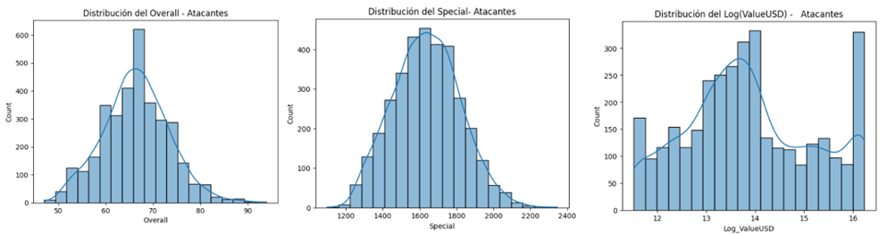

**Graficas mediocampos:**
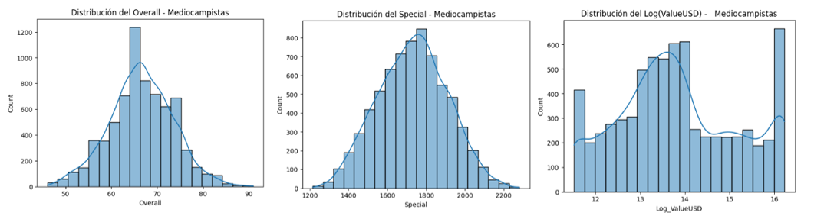

**Graficas defensas:**
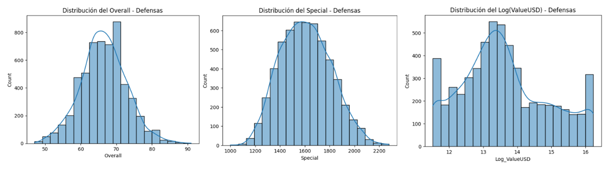

- Las variables Overall y Special presentan una distribución casi normal en atacantes, mediocampos y defensas, con medianas cercanas a 65–70 puntos.

- El valor de mercado (Log(ValueUSD)) muestra una mayor dispersión, evidenciando la desigualdad económica entre jugadores promedio y élite.

**Graficas arqueros:**


- En los arqueros, las tres distribuciones cambian notablemente: El Overall es más irregular y menos centrado, el Special es más concentrado (entre 1000 y 1200), el Log(ValueUSD) está sesgado a la izquierda: la mayoría de los porteros tienen bajo valor de mercado, con pocos casos extremos.

Los jugadores de campo siguen patrones similares de rendimiento y valor, mientras que los arqueros conforman un grupo estadísticamente distinto, lo que valida su análisis y modelado independiente.


### Análisis bivariados

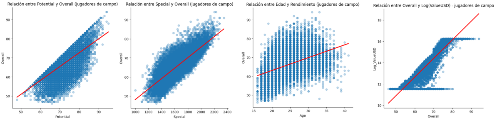

- Potential vs Overall: relación casi lineal y positiva → los jugadores con mayor potencial tienden a tener un mejor rendimiento actual.

- Special vs Overall: correlación muy alta → las habilidades técnicas agregadas son un fuerte indicador del desempeño.

- Age vs Overall: relación no lineal → el rendimiento crece hasta los 28–30 años y luego declina, justificando la variable Age².

- Log(ValueUSD) vs Overall: crecimiento logarítmico → el valor de mercado se estabiliza en jugadores élite, lo que muestra una saturación económica natural.

  
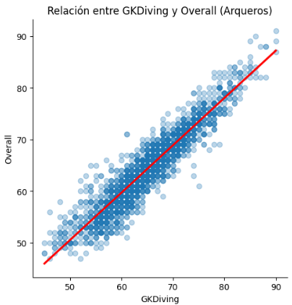

- En arqueros, la variable GKDiving tiene la mayor influencia sobre Overall, reflejando la dependencia de habilidades específicas.

Estas relaciones confirman que Potential, Special, WageUSD y Age² son las variables más relevantes para el modelado predictivo del rendimiento.


### Análisis multivariado

Distribución por rol:
- Defensas: 5 699  
- Mediocampos: 7 002  
- Atacantes: 3 414  
- Arqueros: 2 015  


**Matriz de correlaciones:**

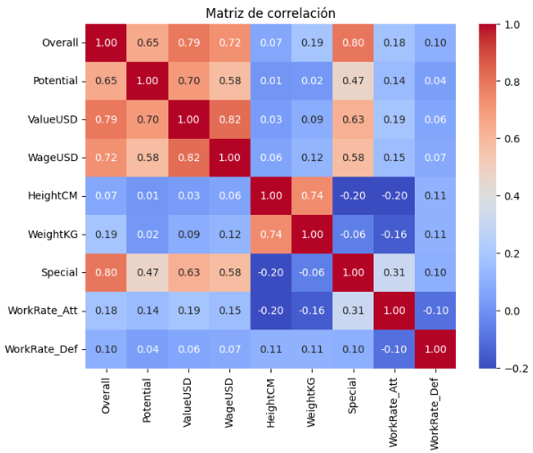

En base a la matriz se obtiene:

| Variables | Correlación | Interpretación |
|------------|--------------|----------------|
| Overall - Special | **0.80** | Relación directa entre habilidad técnica y rendimiento |
| Overall - ValueUSD | **0.79** | Valor de mercado aumenta con el rendimiento |
| Overall - WageUSD | **0.72** | Sueldo refleja desempeño |
| Overall - Potential | **0.65** | Potencial y desempeño casi lineales |
| Altura/Peso | ~0.10 | Influencia marginal |

- Los jugadores entre **20–30 años** alcanzan el mejor rendimiento promedio.
- `Potential` y `Special` son los mejores predictores del desempeño.  
- El valor de mercado crece exponencialmente hasta un **punto de saturación** alrededor de `Overall = 80`.  
- El **rol** no influye significativamente en la calificación general (p > 0.05).


---

## 3. Entrenamiento del Modelo

Después del análisis exploratorio (EDA), se construyeron y evaluaron distintos modelos para **predecir el rendimiento general (`Overall`) de los jugadores**.  
El proceso incluyó el uso de regresión lineal, Random Forest básico y una versión optimizada mediante *Optuna* (Random Forest Tuned).  

El modelo final alcanzó un **R² = 0.962** y un **error promedio (MAE) de 0.872**, lo que significa que **predice con gran precisión el nivel de un jugador** usando variables físicas, técnicas y económicas.

---

### Importancia de las variables

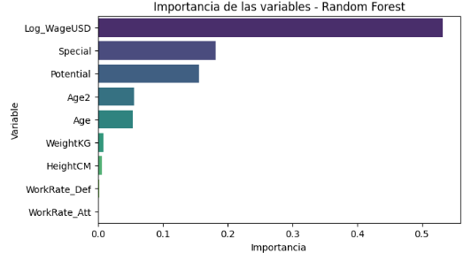

Esta gráfica muestra qué características fueron más influyentes en la predicción del rendimiento:

- **Log_WageUSD:** el salario del jugador es el mejor indicador de su rendimiento, reflejando su valor en el mercado.
- **Potential y Special:** miden el potencial máximo y las habilidades técnicas, fuertemente ligadas al desempeño real.
- **Age y Age²:** capturan la evolución natural del jugador (progreso, madurez y declive).
- Las medidas físicas (`HeightCM`, `WeightKG`) y las tasas de trabajo (`WorkRate_Att`, `WorkRate_Def`) influyen poco.

En conjunto, el modelo aprendió una lógica **coherente con la realidad del fútbol profesional**: los jugadores con más experiencia, mejor salario y mayor potencial suelen tener un rendimiento más alto.

---

### Efecto de la edad y la edad²

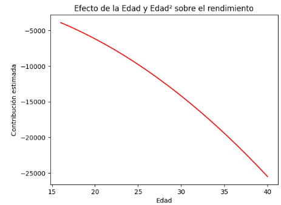
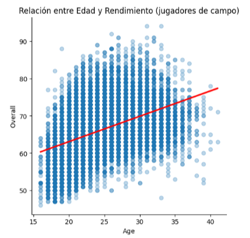

El gráfico muestra cómo cambia el rendimiento con la edad.  
Aunque mantenga una curva descendente su relación con el rendimiento no presenta linealidad, ya que la edad es un factor que refleza madurez de juego en conjunto con el descenso en cualidades físicas.  

Esto refleja que los jugadores jóvenes están en crecimiento, los adultos alcanzan su pico, y los veteranos bajan su nivel.  
Por eso fue necesario incluir **`Age²` (edad al cuadrado)**: permite al modelo entender **una relación curvada**, más realista que una línea recta.

---

### Comparativa de modelos

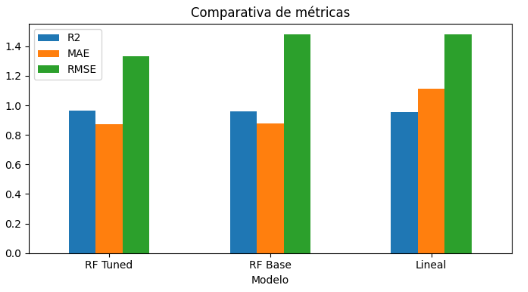

Se compararon tres enfoques:

| Modelo | R² (Precisión) | MAE (Error medio) | RMSE |
|--------|----------------|-------------------|------|
| **Random Forest Tuned** | **0.962** | **0.872** | **1.331** |
| Random Forest Base | 0.957 | 0.910 | 1.470 |
| Lineal | 0.951 | 1.123 | 1.480 |

- Cuanto mayor es el valor de R², más cerca está la predicción de los datos reales.  
- Cuanto menores son MAE y RMSE, menos se equivoca el modelo.

El modelo **Random Forest Tuned** es el más preciso, reduciendo los errores y explicando el **96% del rendimiento real** de los jugadores.

---

### Comparación de predicciones


Cada punto representa un jugador:

- El eje X muestra el **valor real** (`Overall` real del jugador).  
- El eje Y muestra el **valor predicho** por el modelo.  
- La línea roja punteada representa la **predicción perfecta**.

Los puntos verdes (**Random Forest Tuned**) están más cerca de la línea roja que los azules (**Lineal**), mostrando que el modelo optimizado predice con mayor precisión.

---

### Distribución de errores o residuos

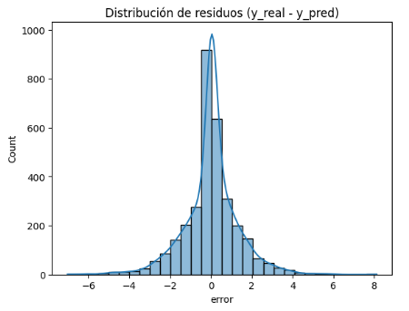

Aquí se analiza cuánto se equivoca el modelo.  
La mayoría de los errores se agrupan alrededor de **0**, lo que significa que **predice correctamente la mayoría de los casos**.  

Su forma de campana indica que los errores son pequeños y aleatorios, sin tendencia a sobrestimar ni subestimar jugadores.

Esto demuestra que el modelo es **estable, confiable y sin sesgos evidentes**.

---

### Importancia por Rol

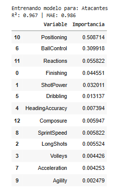 
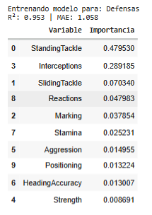
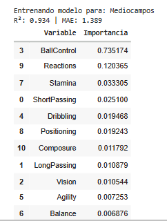
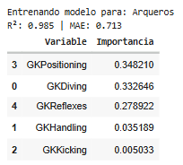


Por motivos de investigación se entrenaron modelos específicos para cada tipo de jugador. Esto permitió identificar las habilidades más determinantes por posición y obtener una comprensión más precisa de los atributos necesarios para calcular el Special, un componente esencial del modelo general para jugadores de campo y arqueros. Además, se evaluó si estos modelos especializados ofrecían una mejora significativa que justificara su uso frente al modelo general.:

| Rol | Atributos más importantes | Interpretación |
|------|----------------------------|----------------|
| **Atacantes** | `Positioning`, `BallControl`, `Finishing` | La ubicación y la precisión son clave. |
| **Mediocampos** | `BallControl`, `Reactions`, `Stamina` | El control, la visión y la resistencia definen su desempeño. |
| **Defensas** | `StandingTackle`, `Interceptions`, `Marking` | Las acciones defensivas directas marcan la diferencia. |
| **Arqueros** | `GKPositioning`, `GKDiving`, `GKReflexes` | Su técnica y ubicación determinan el rendimiento bajo el arco. |

Cada modelo reflejó correctamente las **habilidades específicas de cada posición** dentro del campo.

---

### Interpretabilidad con SHAP

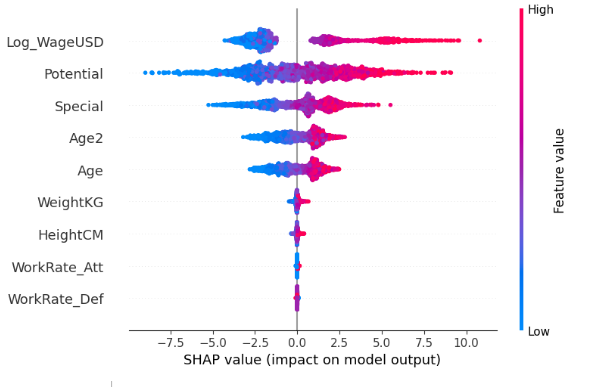

Los valores **SHAP** muestran cuánto contribuye cada variable a la predicción.  
Cada punto es un jugador:  
- Los colores rosados indican valores altos (que aumentan la predicción).  
- Los azules indican valores bajos (que la reducen).  

Esto permite entender **cómo y por qué el modelo llega a cada resultado**, haciendo el modelo **transparente y explicable**.

---

### Sesgo por edad

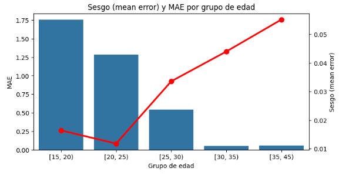

Se observó que el modelo tiene mayor error en **jugadores jóvenes (15–25 años)**, ya que su rendimiento suele ser más variable.  
En cambio, con jugadores adultos (25–35 años), el modelo es **más preciso y consistente**.

Esto coincide con el comportamiento real en el fútbol: los jugadores jóvenes son más impredecibles, mientras que los experimentados tienen un rendimiento más estable.

---

**Resumen del entrenamiento:**
- El modelo Random Forest Tuned fue el más eficiente y preciso.  
- Los resultados fueron coherentes con el comportamiento real del rendimiento deportivo.  
- No se detectaron sesgos importantes entre roles, edades o pies dominantes.  
- El modelo es explicable, confiable y generaliza bien para distintos tipos de jugadores.

---
## 4. Demostración e Inferencias (Uso de Pipeline)
El [**pipeline**]([https://github.com/CrisPih/PulseraApp](https://github.com/stikrobinson/Analisis_Rendimiento_Jugadores/blob/main/notebooks/02_pipeline_finalGrupo4.ipynb)) contiene **todo el proceso automático de predicción del rendimiento (Overall)** de los jugadores FIFA-19.  
Integra desde la limpieza de datos hasta la predicción final del modelo optimizado (Random Forest Tuned).

Incluye:
- Limpieza y conversión de datos (altura, peso, salario, etc.).
- Creación de variables derivadas (Age², Log_WageUSD, WorkRate_Att, etc.).
- Selección automática del modelo según el rol (jugador de campo o arquero).
- Predicción final del atributo **Overall**.


### Instalación de dependencias

Antes de ejecutar el pipeline, instala las librerías necesarias usando el archivo `requirements.txt`:

```bash
pip install -r requirements.txt
```

###Cargar el pipeline entrenado

El modelo final fue empaquetado como un pipeline completo en models/pipeline_fifa.pkl.

Cargar el pipeline entrenado:

```python
import joblib

# Cargar el modelo completo
pipe = joblib.load("models/pipeline_fifa.pkl")

print("✅ Pipeline cargado correctamente")
```

El pipeline devuelve una estimación del rendimiento general (Overall) con base en las variables ingresadas.
Además, selecciona automáticamente el submodelo correspondiente (jugadores de campo o arqueros).

### Demostración del pipeline para predicción

```
pipe = joblib.load("pipeline_fifa.pkl")

# Ejemplo de uso con nuevas filas (directamente del CSV original)
nuevos_jugadores = df_raw.sample(3)
predicciones = pipe.predict(nuevos_jugadores)
pd.DataFrame({
    'Name': nuevos_jugadores['Name'],
    'Predicción Overall': predicciones
})

```


Al ejecutar el código previamente mostrado se obtiene:

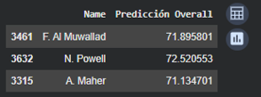

En base al cuadro obtenido, podemos observar que N. Powell presenta la mayor predicción de rendimiento general (Overall = 72.52), seguido por F. Al Muwallad (71.89) y A. Maher (71.13).
Esto indica que, según el modelo entrenado, Powell posee un conjunto de atributos técnicos, físicos y económicos ligeramente superiores a los de los otros dos jugadores, lo que se traduce en un desempeño global más alto.

El modelo Random Forest Tuned logra distinguir diferencias sutiles en los perfiles de los jugadores y asigna calificaciones acordes con sus características individuales.
Los resultados mantienen coherencia con las tendencias identificadas durante el análisis exploratorio:

- Los jugadores con mayor potencial (Potential) y habilidades técnicas agregadas (Special) tienden a alcanzar valores más altos de rendimiento.

- Factores económicos como el salario (Log_WageUSD) también influyen significativamente en el Overall final.

- Las predicciones se encuentran dentro del rango esperado (70–75), lo que demuestra que el modelo es consistente y realista.

En conclusión, el pipeline implementado predice de forma precisa y coherente el nivel de rendimiento de los jugadores, reflejando correctamente la jerarquía de desempeño estimada por sus características individuales.


---
## 5. Hallazgos Generales

- Los jugadores tienen su rendimiento máximo hasta los 30 años aproximadamente. Luego, el rendimiento tiende a descender gradualmente, reflejando el desgaste físico acumulado.
- Existe una correlación positiva muy fuerte entre Potential y Overall, lo que demuestra que los jugadores con mayor potencial tienden a alcanzar también niveles altos de rendimiento actual.
- Aunque las medianas de rendimiento (Overall) son similares entre defensas, mediocampistas y atacantes, se encontró que los jugadores ofensivos (atacantes y medios) poseen valores de mercado y salarios ligeramente más altos.
- El valor económico (ValueUSD) aumenta de forma exponencial con el rendimiento, pero presenta un punto de saturación alrededor de un Overall aproximadamente de 80, lo que indica un “techo” en la valoración de jugadores de élite.

---

## 6. Conclusiones

- El modelo Random Forest identificó que las variables más determinantes para predecir el "Overall" son Log_WageUSD (Salario) que explica más del 53% de la influencia, Special (habilidades técnicas y físicas combinadas) con 18.2% de influencia y potential (Potencial) con 15.6% de influencia. Estas tres variables juntas representan más del 85% de la importancia total del modelo.
- El modelo Random Forest demostró una mejor capacidad de generalización que la regresión lineal para el rendimiento de los jugadores.
- Es posible predecir el rendimiento de un jugador con alta precisión con un 96.2% de la variabilidad explicada utilizando modelos de machine learning.
- El rendimiento de un jugador está más influido por sus atributos técnicos (Special, Potential) y económicos (salario, valor) que por factores físicos o posicionales.

---

## 7. Recomendaciones

- Para futuras predicciones del "Overall", es una buena opción utilizar el modelo Random Forest Tuned, ya que demostró un rendimiento superior, un coeficiente de determinación más alto (0.961) y un error absoluto medio más bajo (0.879) en comparación con el modelo lineal.
- Dado que variables como WeightKG (0.9%), HeightCM (0.6%), WorkRate_Att (0.19%) y WorkRate_Def (0.19%) tienen una influencia prácticamente nula, se recomienda eliminarlas del modelo. Esto puede simplificar el modelo sin afectar significativamente su precisión.
- Probar otros algoritmos como XGBoost, dado que suelen ser más precisos que el Random Forest y ofrecen mejor rendimiento y velocidad, especialmente con datos grandes.
- Agregar información más reciente sobre jugadores de la FIFA, para hacer el modelo más general donde se incluyan variables nuevas que puedan influir en el rendimiento como minutos jugados, lesiones o goles.
